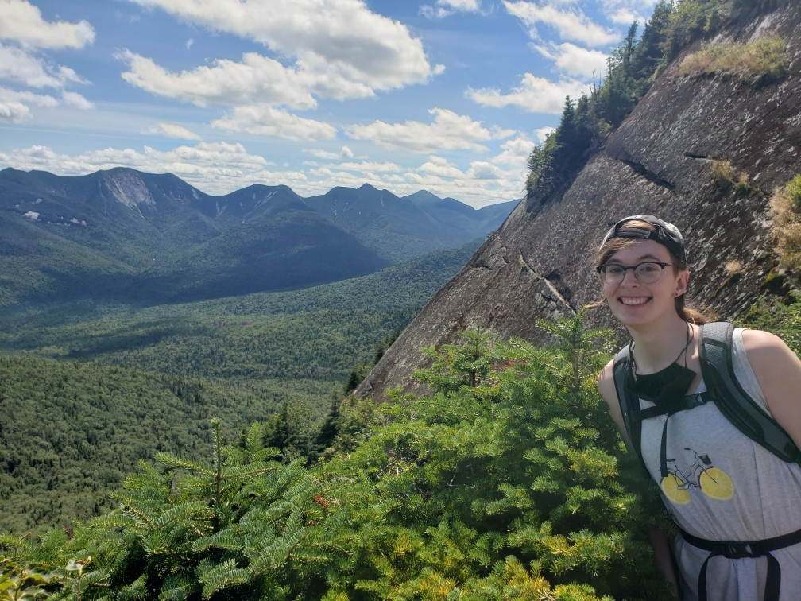
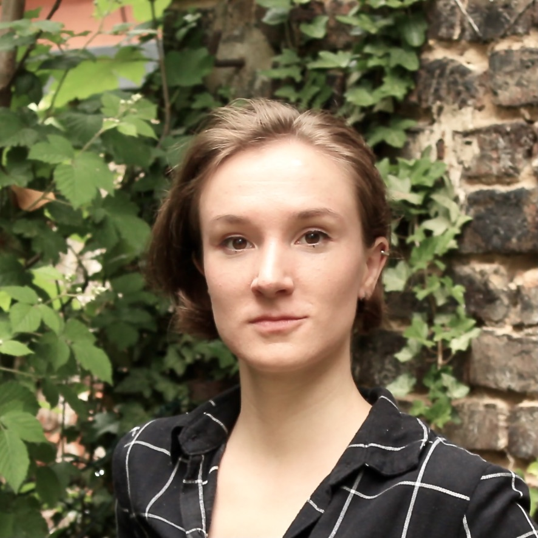

## About us

The Harvard Faculty of Arts and Sciences Informatics Group (FAS Informatics) is a small group of scientists and software developers working to advance research and teaching by facilitiating computational analysis of scientific data, primarily in biology. We work closely with data-generating scientific cores and with students, postdocs, and faculty generating data to help make research and discovery efficient and productive. 

The mission of the Bioinformatics Core includes training, consulting, and research. We run workshops on a variety of subjects of interest to researchers at Harvard and beyond, focusing on introductory and intermediate topics designed to introduce scientists to tools and techniques for the computational analysis of biological big data. We provide one-on-one advice to individuals or lab groups who need assistance with figuring out bioinformatics approaches or debugging computational methods. We conduct research, both grant-funded and as part of collaborations with labs on campus, with a general focus on method development and best practices investigations to meet the needs of the research community. 

Read more about the people in our group below:

## People

	

		

		

			<b><a href="about/people/timsackton/">Tim Sackton, Ph.D.</a></b> 

		

		

	

	

	

		

		

			
			

				

				

					

						<a class="icon-link" href="https://scholar.google.com/citations?hl=en&user=u8RfnXoAAAAJ&view_op=list_works&sortby=pubdate" target="_blank" title="Google Scholar link for Tim Sackton">
							

								
							

							Scholar
						</a>
					

				

				

				

					

						<a class="icon-link" href="https://github.com/tsackton" target="_blank" title="GitHub profile link for Tim Sackton">
							

								
							

							GitHub
						</a>
					

				

				

			

		

		

		

			<b>Director of Bioinformatics</b> 
			 Northwest Labs, B227.10 
			
Tim runs the Bioinformatics group. While his background is population and comparative genomics, these days he does a little bit of everything.

		

		

	

	

	

		

		

			<b><a href="https://ahfgenomics.com/" target="_blank">Adam Freedman, Ph.D.</a></b> 

		

		

	

	

	

		

		

			
			

				

				

					

						<a class="icon-link" href="https://scholar.google.com/citations?hl=en&user=6Bt9l1wAAAAJ&view_op=list_works&sortby=pubdate" target="_blank" title="Google Scholar link for Adam Freedman">
							

								
							

							Scholar
						</a>
					

				

				

				

					

						<a class="icon-link" href="https://github.com/adamfreedman" target="_blank" title="GitHub profile link for Adam Freedman">
							

								
							

							GitHub
						</a>
					

				

				

			

		

		

		

			<b>Senior Bioinformatics Scientist</b> 
			 Northwest Labs, B227.30 
			
Adam is our resident expert in genome annotation and RNA-seq analysis, and also has a background in population and conservation genetics.

		

		

	

	

	

		

		

			<b>Danielle Khost, Ph.D.</b> 

		

		

	

	

	

		

		

			
			

				

				

					

						<a class="icon-link" href="https://github.com/danielle-khost" target="_blank" title="GitHub profile link for Danielle Khost">
							

								
							

							GitHub
						</a>
					

				

				

			

		

		

		

			<b>Senior Bioinformatics Scientist</b> 
			 Northwest Labs, B227.65 
			
Danielle is our resident expert in long read sequencing, and works on a variety of challenging genome assembly problems.

		

		

	

	

	

		

		

			<b><a href="https://gwct.bio/" target="_blank">Gregg Thomas, Ph.D.</a></b> 

		

		

	

	

	

		

		

			
			

				

				

					

						<a class="icon-link" href="https://scholar.google.com/citations?hl=en&user=4pydfEUAAAAJ&view_op=list_works&sortby=pubdate" target="_blank" title="Google Scholar link for Gregg Thomas">
							

								
							

							Scholar
						</a>
					

				

				

				

					

						<a class="icon-link" href="https://github.com/gwct" target="_blank" title="GitHub profile link for Gregg Thomas">
							

								
							

							GitHub
						</a>
					

				

				

			

		

		

		

			<b>Senior Bioinformatics Scientist</b> 
			 Northwest Labs, B227.65 
			
Gregg develops phylogenetic methods and has studied convergent evolution, molecular evolution of rodents and insects, and mutation rates in primates.

		

		

	

	

	

		

		

			<b>Lei Ma, Ph.D.</b> 

		

		

	

	

	

		

		

			
			

				

				

					

						<a class="icon-link" href="https://github.com/microlei" target="_blank" title="GitHub profile link for Lei Ma">
							

								
							

							GitHub
						</a>
					

				

				

			

		

		

		

			<b>Senior Bioinformatics Scientist</b> 
			 Northwest Labs, B227.20 
			
Lei is primarily responsible for developing training and outreach material; she also has a background in metagenomics and microbial ecology.

		

		

	

	

	

		

		

			<b><a href="https://osipovarev.github.io/" target="_blank">Katya Osipova, Ph.D.</a></b> 

		

		

	

	

	

		

		

			
			

				

				

					

						<a class="icon-link" href="https://scholar.google.com/citations?hl=en&user=OhvZN8cAAAAJ&view_op=list_works&sortby=pubdate" target="_blank" title="Google Scholar link for Katya Osipova">
							

								
							

							Scholar
						</a>
					

				

				

				

					

						<a class="icon-link" href="https://github.com/osipovarev" target="_blank" title="GitHub profile link for Katya Osipova">
							

								
							

							GitHub
						</a>
					

				

				

			

		

		

		

			<b>Postdoctoral Fellow</b> 
			 Northwest Labs, B227.65 
			
Katya works on convergent evolution of brood parasitic birds, funded by an NSF grant to study the genomics of these species.

		

		

	

	

Prior to 2025, the group also included the Software Operations Core. Their mission is to support the needs of data generation core facilities by developing software infrastructure. This includes everything from data processing pipelines, to instrument scheduling and training, to billing and invoicing.

As of February 2025, Software Operations has moved to [Research Computing :octicons-link-external-24:](https://www.rc.fas.harvard.edu/){:target="_blank"}!

### Group Alumni

		Abhratanu Saha 

		(2024) 

		
Abhro was a visiting student from the Curie Institute in France. He used comparative genomics to study Hi-C maps in Lepidoptera.

		<a href="https://www.subir.com.np/" target="_blank">Subir Shakya </a> 

		(2021-2024) 

		
Former postdoc, Subir works on population and comparative genomics of birds. He is now a postdoc at LMU Munich.

		Rawan Olayan 

		(2021-2024) 

		
Rawan was funded by a collaboration with Boehringer Ingelheim, and works on single cell RNA-seq methods.

		Jared Vessella-Smith 

		(2023-2024) 

		
Former full stack developer for instrument facility applications

		Alexandria D'Souza 

		(2019-2022) 

		
Alexandria primarily worked with the mass spec core and the Woo lab while she was in the group.

		Scott Van Buren 

		(2020-2022) 

		
Scott is now a Scientific Investigator in Computational Biology at GSK.

		Meghan Correa 

		
Former full stack developer currently at Cisco

		<a href="https://www.mtroyal.ca/ProgramsCourses/FacultiesSchoolsCentres/ScienceTechnology/Departments/Biology/Faculty/Sara-Smith-Wuitchik.htm" target="_blank">Sara Smith Wuitchik </a> 

		(2019-2021) 

		
Sara is now an Assistant Professor at Mount Royal University in Calgary, Canada.

		Alex Llanos Garrido 

		(2019-2021) 

		
Alex is now at the Universidad Complutense Madrid.

		Juerg Straubhaar 

		(2017-2021) 

		
Juerg worked primarily on proteomics data with the Mass Spec Core and the Melton Lab while he was in the group.

		<a href="https://brian-arnold.github.io/about/" target="_blank">Brian Arnold </a> 

		(2018-2020) 

		
Brian is now a departmental data scientist with the Ecology and Evolutionary Biology department at Princeton.

		Yasin Kaymaz 

		(2017-2020) 

		
Yasin is now an Assistant Professor at Ege University in Izmir, Turkey.

		<a href="https://tommytang.bio.link/" target="_blank">Ming "Tommy" Tang </a> 

		(2018-2020) 

		
Tommy is now the Director of Computational Biology at Immunitas Therapeutics.

		<a href="https://veronikalaine.netlify.app/" target="_blank">Veronika Laine </a> 

		(2019) 

		
Veronika is now at the Finnish Museum of Natural History working on bats.

		John Gaspar 

		(2017-2019) 

		
John is now a Data Science and Bioinformatics Team Lead at Merck.

		<a href="https://www.allisonshultz.com/" target="_blank">Allison Shultz </a> 

		(2017-2018) 

		
Allison is now the Associate Curator of Ornithology at the Natural History Museum of Los Angeles County.

		Andy Bryant 

		
Former front end developer for instrument facility applications

## Where to Find Us

We are located in [Northwest Science Building :octicons-link-external-24:](https://mapprod.cadm.harvard.edu/portal/apps/indoors/?appid=2c3969f8d1b14147920610a68f6db713&itemUniqueIdField=facility_id&itemSourceKey=Facilities&itemUniqueId=CA-04560){:target="_blank"}, on the B2 floor, near the [Bauer Sequencing Core :octicons-link-external-24:](https://bauercore.fas.harvard.edu/){:target="_blank"}. Our offices are in the B227 suite. We hold regular office hours, and you can also contact us [here](contact.md).

Harvard FAS Informatics Group  
[Northwest Building :octicons-link-external-24:](https://nw.fas.harvard.edu/){:target="_blank"} B227  
52 Oxford Street  
Cambridge, MA 02138  
[Map :octicons-link-external-24:](https://mapprod.cadm.harvard.edu/portal/apps/indoors/?appid=2c3969f8d1b14147920610a68f6db713&itemUniqueIdField=facility_id&itemSourceKey=Facilities&itemUniqueId=CA-04560){:target="_blank"}