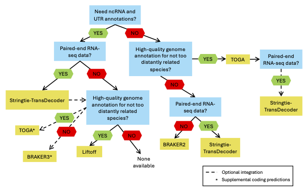

With the rapid increase in the number of new genomes being assembled, the strigent input data requirements for publicly available resources for automating genome annotation (e.g. Ensembl and NCBI), and inevitable increasing wait times for the production of new annotations by those resources, researchers will be increasingly faced with having to generate annotations for their new genome builds themselves. The two immediate challenges they face are:

1. Deciding which tools are best suited for generating a high-quality annotation, and 
2. Actually running those tools on an HPC cluster.

Here, we provide a brief overview of the three dominant flavors of genome annotation represented by current state-of-the-art tools, provide guidance for picking the right tools, and briefly describe and point to [Snakemake](https://snakemake.readthedocs.io/en/stable/) worfklows that can, with a modest amount of parameter specification, automate the generation of genome annotations in gff/gtf format. If you are unfamiliar with this file format, take a look at [this file format definition](http://useast.ensembl.org/info/website/upload/gff.html) found at *Ensembl*.

## What do we mean by genome annotation?
"Genome annotation" is typically used to refer to two discrete bioinformatics tasks. The first of these is structural annotation, namely the prediction of the genomic intervals comprised of functional genome features: genes, transcripts associated with those genes, the exons comprising those transcripts, and for protein-coding transcripts their CDS and UTRs. The second meaning of genome annotation is functional annotation, namely assigning gene symbols, Gene Ontology terms, and putative functions with respect to molecular phenotype. This tutorial is focused on the first of these meanings, namely choosing and running tools to predict functional features on a genome assembly.

## Three major approaches to genome annotation
### 1. Model-based approaches
The current state-of-the-art tools for genome annotation can be divided into three categories. The first of these is the model-based approach that uses a Hidden Markov Model (HMM) to scan a genome sequence, classify particular segments as protein-coding, and group these coding sequence (i.e CDS) intervals into transcripts, and to aggregate those transcripts into genes. Among the several tools that use this approach, the most well-known and widely used is [AUGUSTUS](https://github.com/Gaius-Augustus/Augustus), the first version of which was published in 2003. Widely used optimized versions of AUGUSTUS are implemented in [BRAKER](https://github.com/Gaius-Augustus/BRAKER), which can take extrinsic evidence in the form of protein sequences or RNA-seq data which are aligned to the genome to provide hints as to where splicing takes place, and to parameterize the underlying HMMs; BRAKER also generates annotations with [Genemark](https://github.com/gatech-genemark). Model-based approaches typically only predict protein-coding features, such that non-coding RNAs and UTRs are not included in their output. 

#### Input data requirements for model-based approaches
* a fasta file of proteins that can be aligned to the genome to generate splice hints and tune HMM parameters. For BRAKER, it is recommended to use a taxonomically appropriate set of sequences from [OrthoDB](https://www.orthodb.org/), and/or
* spliced alignmentof paired-end RNA-seq reads (derived from your species) to your genome in bam format. Our Snakemake workflow for BRAKER (see below) allow you to provide the RNA-seq data in fastq format, as one variant of the workflow can take those reads and align them to the genome with [STAR](https://github.com/alexdobin/STAR).  

### 2. Assembly of RNA-seq reads
The second general approach is evidence-forward, with transcript and gene models being constructed from splice graphs that are built from spliced alignments of RNA-seq reads to the genome. Given a minimal amount of read coverage over a genomic interval, tools that implement this approach will assemble transcripts. The current state-of-the-art for this approach is represented by [Stringtie](https://ccb.jhu.edu/software/stringtie/) and [Scallop](https://github.com/Kingsford-Group/scallop). These methods do not classify exons as protein-coding (CDS), such that, in order to add CDS annotations to their output, one must use a tool that detects and annotates open reading frames (ORFs) such as [TransDecoder](https://github.com/TransDecoder/TransDecoder).

#### Input data requirements for RNA-seq assembly
* Paired-end RNA-seq reads in fastq format. 
* If you are using a downstream tool to predict CDS and UTRs, most likely you will also need a BLAST database of proteins from closely related species.

### 3. Annotation transfer
Annotation transfer or "liftover" is an approach where, through a whole genome alignment between a high-quality genome assembly (and a similarly high-quality annotation) and an unannotated target genome, annotations are transferred to homologous intervals in the target genome. One top-performing approach is [TOGA](https://github.com/hillerlab/TOGA), which transfers (only) protein-coding annotations in an exon-aware fashion, making adjustments to maximize the retention of complete ORFs. Another is [Liftoff](https://github.com/agshumate/Liftoff) which transfers both coding and non-coding annotations. The quality of annotations output for the target genome depend upon the completeness and quality of the source annotation and the quality of the whole-genome alignment. The latter of these is determined in large part by the extent of evolutionary divergence between the source and target genomes, such that performance declines with increasing divergence and it is recommended to use, when possible, a closely related source genome. The quality of the whole-genome alignment is also impacted by genome complexity and organization, such that liftover tools may run into problems with large, complex plant genomes that contain a large proportion of repeat elements.

#### Input data requirements for annotation transfer
* A whole genome alignment of your species' genome, and the genome of your reference species
* An annotation file (in gff3 format) for your reference species, i.e. the annotations that will be transferred through the genome alignment

## Choosing an annotation method
How to choose a genome annotation method should be based upon three factors:

1. Your research objectives. For example,are you only interesting protein coding genes, or even just extracting the CDS portion of transcripts, or are you also interested in ncRNAs and the UTRs of protein-coding transcripts? In other words, are you intersted in the entire transcriptome, or is your primary focus the proteome (either in nucleodide or amino acid space).  

2. Availability or ability to generate paired-end RNA-seq data  

3. Availability of a high quality genome and annotation from a reasonably closely related species (relative to your target genome) 

4. Annotation method performance, with respect to your research objectives 

While the first of these points is dependent upon your research program, the second depends upon the feasibility of obtaining RNA-seq data, and the third depends upon the history of past genomic research in the portion of the tree of life where your research program is focused. We have answered the fourth of these with a comprehesive review of genome annotation method performance. An earlier version of the manuscript resulting from this work is on bioRxiv at ["Building better genome annotations across the tree of life"](https://www.biorxiv.org/content/10.1101/2024.04.12.589245v1), and the final version (that includes two additional methods) will appear in the May 2025 issue of *Genome Research*. Our findings have led us to recommend the following decision tree for picking an annotation method.
   

The dashed lines that indicate "optional integration" refer to the combining of more than one genome annotation method, which we elaborate upon below.

### Integrating methods: a work in progress
If, after testing a few different methods, you might discover that there is some degree of complementarity in the recovery of conserved single-copy orthologs, i.e. BUSCOs [see this paper](https://academic.oup.com/bioinformatics/article/31/19/3210/211866) for more details. The current challenge is *how* to go about doing this. There are few currently maintained tools for combining an arbitrary number of gtf/gff3 files into a unified annotation. One example is [Mikado](https://github.com/EI-CoreBioinformatics/mikado) although our initial exploration of it a few years ago indicated that the scoring scheme for picking high quality transcripts may lead to the erroneous removal of real transcripts, and a subsequent loss of BUSCOs. At a future date we will explore the integration problem more deeply, and perhaps even come up with a solution! In the meantime, Mikado is worth looking at. A simpler, different approach that will not lead to any data loss would be to add annotations from one method that are non-overlapping with a "base" annotation (the entirety of which you will retain) to that base annotation

1. Given two annotation files for your genome, set one as the "base", i.e the one you want to which you want to add additional annotations
2. Use [bedtools](https://bedtools.readthedocs.io/en/latest/) to identify unique annotations in your second annotation method, i.e. those that do not overlap the genomic coordinates of your "base" annotation. 
3. Add those non-overlapping annotations to the "base". In principle, one does this at the gene-level, adding non-overlapping genes and their respective child features to the "base" annotation. 
4. If you have more than two annotations to integrate, set the initially integrated annotation as your base, and follow the steps above with the next annotation.

## Workflows for generating individual annotations.
We have developed Snakemake workflows for *TOGA*, *BRAKER*, and assembly of genes and transcripts directly from RNA-seq reads with *Stringtie* and *TransDecoder*. Those workflows can be found here: 

* [Snakemake TOGA](https://github.com/harvardinformatics/AnnotationTOGA) 
* [Snakemake BRAKER](https://github.com/harvardinformatics/AnnotationBRAKER) 
* [Snakemake Stringtie-TransDecoder](https://github.com/harvardinformatics/AnnotationRNAseqAssembly)

While we do not provide a Snakemake workflow for Liftoff, it is a straightforward one-line execution that can be reconstructed from the documentation, or following our implementation in our forthcoming paper in *Genome Research*, using parameters to span varying degrees of evolutionary divergence, and is described [here](https://github.com/harvardinformatics/GenomeAnnotation/tree/master/GenomeResearch/Liftoff).

## Assesing genome annotation quality
For a new genome assembly, quality metrics will need to be used that don't rely on a "truth set", such as aa well-curated set of protein sequences for the species whose genome you have just assembled. Relevant metrics should be able to assess sensitivity (the ability to recover the real underlying transcripts in a genome) and accuracy, i.e. how well the predicted features recapitulate the true sequences. Again, in the absence of a truth set for one's species, there are metrics that employ useful proxies. A few of these are as follows:

* BUSCO score, which is simply (1 - number of recovered BUSCOs)/total number of BUSCOs in the searched database. The best way for obtaining the count of recovered BUSCOs is to use [compleasm](https://github.com/huangnengCSU/compleasm) to perform sequence searches.

* A global score of proteome accuracy obtained with [psauron](https://github.com/salzberg-lab/PSAURON). psauron is a machine-learning approach, the underlying model of which was trained on  > 1000 species. It not only provides a global accuracy score for a proteome, but also provides transcript scores, which are potentially useful for post-annotation filtering of low-quality predictions

* If there is a high-quality annotation of a reasonably closely related species, looking at BLASTX coverage of the predicted proteins from your annotation against the proteome of that species. If your annotation has generated a large proportion of high-quality, complete or near-complete protein predicttions, The median BLASTX coverage of the reference species proteins by your predicted proteins should be very high.

* RNA-seq read alignment rate. An acceptable rate will depend upon whether downstream gene expression analyses will conducted, as low alignment rates may reduce precisions of expression counts and reduce power of differential expression analyses.

* Frequency of single-exon transcripts. For example, an annotation comprised mostly of short single-exon transcripts would suggest a highly fragmented annotation, with "genes" likely representing fragments of the true gene intervals. 

* Length distribution of transcripts. If the median transcript length of your annotation is 30% of the median length of a well-annotated closely related species, this would point to your annotation being comprised of fragmented transcript models. 

