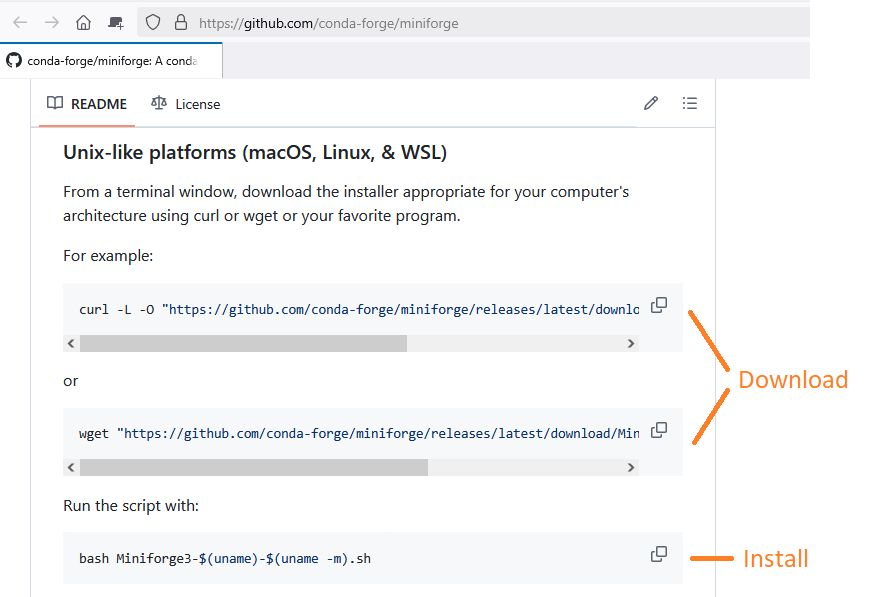
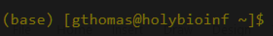
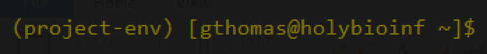

Many scientific software packages are run by text commands via the **command line**. For installing command line software and managing environments, either on your local computer or on a remote server, we recommend **conda** and **mamba**.

**conda** is a cross-platform package manager, as well as the name of the command-line tool to access conda channels.

**mamba** is a re-implementation of the conda command-line tool and is generally much faster than the conda version.

!!! note "mamba vs. conda"

    We recommend using **mamba** as the command-line tool and will do so through this tutorial, but you can use **conda** if you prefer. Simply replace `mamba` with `conda` in all the commands. Likewise, anywhere in the text we refer to **mamba** you could substitute with **conda**.

## 1. Installing mamba

!!! tip "Check if mamba/conda is already installed"

    If you are on an institutional server or cluster, it is possible they already have mamba (or conda) installed and activated. You can check this by running the command `mamba --version`. If you see the text **mamba X.X.X**, with each X being a number, then mamba is already installed and you can skip to step 2! If you see some form of the error message **Command not found**, then you will have to install mamba.

To install mamba, first navigate to the [Miniforge3 repository page](https://github.com/conda-forge/miniforge). Miniforge is a minimal installer for conda and mamba. On this page, scroll down to the **Install** section and follow the instructions for your operating system.

### Mac/Linux

<center>

</center>

On Mac and Linux machines (the [Harvard cluster runs a version of Linux](https://www.rc.fas.harvard.edu/about/cluster-architecture/)), you'll want to open your Terminal or login to the server to type the download and install commands.

#### Download the installation script

For downloading, Miniforge provides two example commands using different programs to download the installation script (`curl` and `wget`). **You only need to run one of these commands!** If you get an error along the lines of **Command not found**, try the other command. This should download the installation script to your current folder.

#### Install

Once the script is downloaded, run the second command to execute it. This will start the installation process. You will have to agree to the terms of service by using the spacebar or the down arrow to scroll to the bottom of the text and then hitting enter. You will also be prompted to initialize mamba, which we recommend you do.

After the installation process is complete, restart your terminal or reconnect to the server to activate mamba.

### Windows

For windows, we recommend installing the **Windows Subsystem for Linux (WSL)**. This will install a Linux environment within your Windows machine that can run concurrently with Windows. Importantly, it will install a Linux shell program called **bash** that will allow you to run the commands above.

* **[Install WSL](https://learn.microsoft.com/en-us/windows/wsl/install)**

If necessary, Miniforge does provide an explicit Windows installer for conda/mamba that you may install instead per the instructions on their page.

## 2. Environments

Once you have followed the above instructions and **restarted your terminal or reconnected to the server**, you should now see that mamba is activated because the `(base)` environment prefix appears before your prompt:

<center>

</center>

mamba can be used to manage environments. **Environments** modify aspects of a user's file system that make it easier to install and run software, essentially giving the user full control over their own software and negating the need to access critcal parts of the file system.

When working on a project one may install all the software for that project in a particular environement, or one may have multiple environments for a given project, especially if a single environment becomes to big.

!!! warning "Don't install software in the (base) environment"

    It is important to manage enviornments cleanly. Because the `(base)` environment contains software related to the functioning of mamba, do not install other software while it is active because the dependencies for those programs may conflict with the base programs. Additionally, larger `(base)` environments will take longer to load on start-up.

### Creating environments

For a given task or project that requires new software to be installed, you will want to create an environment:

```bash
mamba create -n project-env
```

The `-n` option allows you to pick a name for your environment. It can be anything descriptive that you want.

### Activating environments

After creating an environment, you can't immediately install software. You must first **activate** that environment:

```bash
mamba activate project-env
```

!!! note "Activating your first environment with mamba"

    The first time you activate an environment with `mamba` after installing it, you may get a message that `mamba` needs to be initialized. Run the command it suggests and restart your terminal and you should be able to use `mamba` to activate enviornments going forward.

Here, you use the name specified after `-n` when you created the environment to activate it. In case you end up creating a lot of environments, you can see a list of all of them with the command:

```bash
mamba env list
```

Once you are in an environment, your prompt should be updated to be pre-fixed with that environment's name:

<center>

</center>

!!! tip "Environments must be activated every time you log on"

    If you shutdown your terminal or disconnect from the server, upon reconnection you will again be in the `(base)` environment. You will need to use `mamba activate` each time to get back to the desired environment.

### Switching between environments

In order to switch from one environment to another, first deactivate your current environment:

```bash
mamba deactivate
```

Then simply run the `mamba activate` command with the desired environment name to switch to.

!!! warning "Deactivating the (base) environment"

    If you accidentally run `mamba deactivate` while in the `(base)` environment, you will need to re-activate it. The easiest way to do this is to disconnect and then reconnect or restart your terminal.

## 3. Installing software

With mamba installed and within an activted environment, we are almost ready to install software from conda (the package repository).

### Channels

The conda package repository has various **channels** in which software packages can be found. A channel is essentially a sub-repository for similarly themed software. For example, **bioconda** is used for software related to bioinformatics. **conda-forge** is also a popular channel that offers more general software (in fact Miniforge which we used to install conda/mamba is a part of conda-forge).

In the likely event that you'll be using the [bioconda](https://bioconda.github.io/) channel, they provide additional commands to set-up your conda configuration for ease of use:

```bash
conda config --add channels bioconda
conda config --add channels conda-forge
conda config --set channel_priority strict
```

This ensures that when you install a package, both the conda-forge and bioconda channels are searched for a package matching that name.

### Searching for packages

While it is certainly possible to type "<software name> conda package" into your favorite search engine and get results, it may be better to directly search the websites of each channel:

* [bioconda](https://bioconda.github.io/)
* [conda-forge](https://conda-forge.org/packages/)
* [Anaconda](https://anaconda.org/)

Anaconda will search all conda channels so it may be the most direct way to search, but be wary of false positives (anyone can create a channel). Additionally, each page should give a short summary of the software and relevant links and, importantly, installation commands for software packages.

### Installation commands

After you've searched the links above for your software of interest, you should be able to copy and paste the command into your terminal, *e.g.* if you're interested in the software [GRAMPA](https://bioconda.github.io/recipes/grampa/README.html#package-package%20&#x27;grampa&#x27;):

```bash
mamba install grampa
```

In some cases, you may want to explicitly specify the name of the channel from which you want to install the software. This can be done in two ways:

```bash
mamba install -c bioconda grampa
```

or

```bash
mamba install bioconda::grampa
```

Then, you should be able to run the software! Usually, the package name and the software name are the same (*i.e.* to run the grampa package you should be able to type `grampa` in the terminal), though this may not be true for every package out there. Hopefully the package is documented well and explains how to run it after installing...

!!! success "Dependencies"

    A **dependency** is a piece of software or code that is used by another program. Traditionally, ensuring one had all the dependencies to run a given program was a big challenge when installing software. Conda negates this by automatically installing dependencies for any package you install! This is why you may see a long list of software when you run `mamba install`.

## Troubleshooting

### 1. `mamba: command not found`

If you see the `mamba: command not found` error when trying to install software or run any of the above commands, it likely means one of two things:

1. mamba isn't yet installed on the computer you're using. Follow the instructions in [1. Installing mamba](#1-installing-mamba)
2. mamba hasn't been initialized. If you didn't indicate Yes to the final prompt when installing Miniforge, your shell hasn't been setup yet. You may need to run `mamba init` and restart your shell. If you try to run `mamba init` and get the same error, you'll have to provide the full path to the mamba executable, which should be something like: `/where/you/installed/miniforge3/bin/mamba`.

### 2. mamba cannot solve the environment or is taking a very long time to install a package

If `mamba install` fails or hangs for a long time, the program might be struggling with installing dependencies given the current settings. This can happen if your dependence graph is too large because you have too many packages installed in one environment. To solve this, try the following:

1. Make sure mamba and conda are up to date. First, ensure that you are in the **(base)** environment by running the command:

```bash
mamba activate base
```

Then, to update mamba, run the command:

```bash
mamba update mamba
```

In this case you may also want to update conda (recall that mamba is installed on top of conda, so conda is still there in the background):

```bash
conda update -n base -c defaults conda
```

2. If you're using bioconda, make sure your [channels are set up to give bioconda priority](#channels).

### 3. `[package name]: command not found`

If you see a `command not found` error for a package you successfully ran `mamba install` on previously, it likely means you aren't in the same environmeny as where you installed the package. Make sure you [activate the correct environment](#activating-environments)


