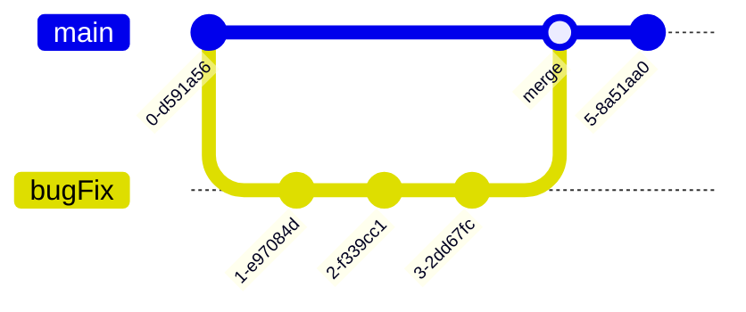

<style type="text/css">
    pre { overflow-x: scroll }
    pre code { white-space: pre; }
    /* This makes the output blocks scroll horizontally in HTML renders */

    .md-sidebar--secondary { order: 0; }
    .md-sidebar--primary { display: none; }
</style>

## Introductions

Welcome to day 3 of Healthy Habits. Today we're going to learn about version control using git/GitHub. While the central concept of git and its use is designed to integrate smoothly into your workflow, it can be unintuitive at first. To start off with let's do introductions and this time let's say your name and say where you primarily get your scripts/code from. For example, I write a lot of my own scripts but sometimes I follow a tutorial online and copy-paste it from there. 

# Why version control is important

Regardless of where your code comes from, usually throughout a project there is an iterative process of writing, testing, and changing your code until you get to the final version that you use in your publication. This may consist of testing out multiple versions of the same code at a time, or maybe one set of scripts for analysis A and another set for analysis B and there's some overlap between the two... Anyway, it can get messy! Version control is a way to manage this process so that you never lose important work and can clearly distinguish between different version of your code.

Using git and GitHub for version control also facilitate working with others, because you can easily share your code on GitHub with others. GitHub also acts as a backup for your code, so you can always start where you left off, even if your local copy gets lost or messed up.

# Basics of git

<div align="center">
    <figure>
        
        <figcaption>Basic git workflow</figcaption>
    </figure>
</div>

Git is a program for version control that takes snapshots of your files at different points in time. These snapshots are called "commits". You can use these commits to go back to previous versions of your code, compare different versions, and even work on multiple versions at the same time, without them interfering with each other. 

This is the central concept of git: You have a working directory where you are interacting with files, changing and and saving them as normal. Then when you want to save a version of your file, you "stage" the file, telling git you want to track the current version. When you've staged all the files you want to take a snapshot of, you "commit" the changes along with a descriptive message.

When you want to time travel to a previous commit, that is called "checking out" a commit. You can check out a whole commit or just a single file from a commit. Checking out a commit/file will change your working directory. We'll go more into detail on checking out commits later. Right now, let's focus on the arrows going to the right, which save your changes to git.

<div align="center">
    <figure>
        
        <figcaption>Relationship between your git repo and GitHub</figcaption>
    </figure>
</div>

Now that you know what git is, this is how GitHub relates. GitHub is a website that hosts git repositories. It's a place where you can share your code with the general public, or just to back up your code. The jargon for this is called a "remote", while the version of your repository on your computer is called the "local" version. You can have multiple local versions (clones) but it's up to you to keep them up to date. 

To transfer code between your local and remote repositories, you use "push" and "pull" commands. "Push" sends your changes to the remote while "pull" grabs the changes from the remote. You can push after a series of commits and all that history will be transferred to the remote. Let's say you're working on the cluster and have been making commits and pushes. Those changes will not be reflected on your local machine until you "pull" the changes from the remote. 

When you want to collaborate with others, you can "fork" their repository, which makes a copy of their repo on your own GitHub account. You can then "clone" this repo to your local machine, make changes, push those changes to the remote, and then make a "pull request" to merge your changes to the original repository. 

## Side note: A potential use-case for git/GitHub in your lab

<div align="center">
    <figure>
        
        <figcaption>Example of working from a forked repo with multiple local copies</figcaption>
    </figure>
</div>

One of the best things about GitHub is that it allows you to share code with others. Raise your hand if you've ever been handed code from a previous student or lab member, but it didn't work for whatever reason. Or perhaps there are just loose scripts floating around, each version slightly different from the last but nobody knows which one is current or which one is the best. One way to avoid this is to have a lab GitHub account where known working versions of scripts are posted and users can fork the repo of helpful scripts to adjust to their own needs. Then, if a user fixes a bug or adds a feature, they can make a pull request and update the lab's version. This way, everyone in the lab can benefit from the work of others and the lab's scripts are always up to date.

The above image illustrates the relationship between a forked repo, the original repo, and local clones of the forked repo. If the repo you forked gets updated, you can sync your fork with the original repo but changes you make on your fork does not affect the original repo. Then, when you're working on a local clone of your repo (on the computer and on the cluster), the way to get them to sync is to push and pull between the two. When you have multiple local clones like this, do not work on the same file in two different places before syncing them by pushing and pulling.

Let's practice all these concepts together on a demo repo.

> **ACTIVITY GitHub demo repo [link](https://github.com/harvardinformatics/github-intro)**

## Vocab part 1

Here are some terms that are useful to know when working with git:

| Term           | Definition                                               |
|----------------|----------------------------------------------------------|
| repository     | a folder tracked by git                                  |
| fork           | copy someone else’s GitHub repo into your own account     |
| clone          | copy a repo from a remote onto your local computer        |
| add            | add file to staging area (start tracking it)             |
| commit         | make a snapshot of staging area to repository            |
| push           | upload changes to remote repo                            |
| remote         | a repository hosted on a server (e.g. GitHub)            |
| staging area   | intermediate area where files are tracked before they are added to git |
| pull           | fetch changes from a remote and merge into existing branch |
| branch         | an isolated development path that was diverted from the main line at a specific commit |
| status         | check the status of your git repo                        |


# .gitignore, pushing to GitHub

Now that we've practiced a bit with a demo repo, let's make our project directory on the cluster into a git repo and push it to GitHub. What defines a git repo is a hidden folder called '.git' that contains all the information about the history of your project. When you make commits, the .git folder is updated with the new information. That's how different versions of your project can be store in a space-efficient way. To make a git repo, run 'git init' in the project directory. Use git status to see what files can be added to the staging area.

> **ACTIVITY make project directory into git repo and upload to github**

```bash
git init
git status
```

Observe that all your files are currently "untracked". You don't want to add all of them to the staging area. This is because git is not a data management system, it's a version control system. Which means it's designed to track changes in plain-text files that contain code. It's not designed to backup binary files or track changes in large files. GitHub has an upload limit of 100 MB so if you accidentally stage a large file, you won't be able to push it to the remote. 

Here's what you should use git for:

- Scripts
- Notebooks
- READMEs
- Configuration files (yamls, config files)

Here's what you should NOT use git for:

- Data
- Software (conda envs, containers)
- Non-plaintext files (pdfs, images, videos, binary files)
- Large files
- Passwords and sensitive information (!!!)
- Log files (slurm logs, error logs, etc)
- Junk files (temp, OS-generated junk)

To avoid staging files you don't want, you can create a file called '.gitignore' and list the files and folders you don't want to track. You can also use "!" before a file name to list files you want to KEEP, for instance one file in a folder you are otherwise ignoring. This file should be in the root of your project directory. Feel free to commit and push this file along with your repo, as it may be useful to keep track of what you're ignoring.

Contents of your gitignore might look like this:
```
*.fq.gz
software/*
```

Once you've made the .gitignore, run `git add . -n` to see what files git can now see after everything in .gitignore is excluded. Now manually add the files you want to commit using `git add <filename>` and commit them using `git commit -m "initial commit"`. 

Before we push, we need to tell git where we want to push to. This is called adding a remote. Remember, git is the version control system we're using while GitHub is a website where we can upload version controlled code projects. The two are distinct! That is why now that we want to upload (aka push) this repo to GitHub, we will need to use the gh command line interface, which was installed in your conda environment. First we'll log in to GitHub using `gh auth login` and then we'll add a remote using `gh repo create` and follow the prompts to both create a repo on GitHub and push our commits to the remote.

```bash
gh auth login
# follow the prompts: Github.com, HTTPS, then Web Browser
# gh will try to open a web browser but will fail. Manually input the address that prints in the message into your computer's web browser
# enter the number on the terminal into the authentication page on your web browser
gh repo create
# What would you like to do select: Push an existing local repository to GitHub
# Path to local repository select: press enter (it will default to the current directory)
# Repository name: press enter (it will default to the name of the current directory)
# Repository owner: press enter (it will default to your username, but you can select and org if you want)
# Description: add a description and press enter
# Visibility: select Public or Private
# Add a remote?: Y and enter
# What should the remote be called?: press enter (it will default to origin)
# Would you like to push commits from the current branch to origin?: Y and enter
```

```
(base) leima@HUIT-FAS-HUITADMINs-MacBook-Pro test-repo % gh repo create
? What would you like to do? Push an existing local repository to GitHub
? Path to local repository .
? Repository name test-repo
? Repository owner microlei
? Description test-repo
? Visibility Public
✓ Created repository microlei/test-repo on GitHub
  https://github.com/microlei/test-repo
? Add a remote? Yes
? What should the new remote be called? origin
✓ Added remote https://github.com/microlei/test-repo.git
? Would you like to push commits from the current branch to "origin"? Yes
Enumerating objects: 3, done.
Counting objects: 100% (3/3), done.
Writing objects: 100% (3/3), 221 bytes | 221.00 KiB/s, done.
Total 3 (delta 0), reused 0 (delta 0), pack-reused 0
To https://github.com/microlei/test-repo.git
 * [new branch]      HEAD -> main
branch 'main' set up to track 'origin/main'.
✓ Pushed commits to https://github.com/microlei/test-repo.git
```

If you want another way to add a remote from an existing repo, you can follow the instructions on the [GitHub help pages](https://docs.github.com/en/migrations/importing-source-code/using-the-command-line-to-import-source-code/adding-locally-hosted-code-to-github#adding-a-local-repository-to-github-using-git). 

# Navigating your git history



Git history can be viewed as a "gitflow" diagram (image above), with commits as nodes and branches as lines. You can see the history of your project using command line options such as: `git log`, `git log --graph --oneline --all`, or by clicking on the "commits" link on GitHub. In VSCode, you can use the extension "Git Graph" to visualize your git history. Commits are identified by a unique **hash**, which is a long string of letters and numbers. Commits also always have a message, which the user writes at the moment they commit. There is a pointer called "HEAD" which points to the current commit you're one. Usually, this is the most recent commit, but HEAD can change if you switch to a different branch or checkout a different commit. 

Below are some slides that illustrate how HEAD moves around as you make commits and branches

=== "Tab 1"

    <div align="center">
        <figure>
            
        </figure>
    </div>

=== "Tab 2"

    <div align="center">
        <figure>
            
        </figure>
    </div>

=== "Tab 3"

    <div align="center">
        <figure>
            
        </figure>
    </div>

=== "Tab 4"

    <div align="center">
        <figure>
            
        </figure>
    </div>

## Checkout

<div align="center">
    <figure>
        
        <figcaption>git checkout</figcaption>
    </figure>
</div>

When you use the `git checkout` command, you can move the HEAD to a different commit, either using the hash or a relative reference like "HEAD^" for the commit before the current one or "HEAD~2" for the commit two before the current one. Using `git checkout` will change the files in your working directory to match the commit you checked out. This is useful for comparing different versions of your code, or for working on different versions of your code at the same time. When you move the head to a different commit, git enters "detached HEAD" state, which is a warning that you're not on a branch and that if you make any commits and switch to a branch, your work may be lost. 

`git checkout` can also be used to create and move HEAD to a new/existing branch, retrieve a specific file from a specific commit, or to discard changes in your working directory. These may seem like disparate uses, but they all involve moving the HEAD to different parts of your git history. 

## Revert

<div align="center">
    <figure>
        
        <figcaption>git revert</figcaption>
    </figure>
</div>

The command `git revert` is used to undo a single commit or a series of commits. It creates a new commit that undoes the changes made in the commit(s) you specify. This is useful if you've made some helpful commits since then and just want to undo changes from a specific time. Git revert is the way to go if you want to undo a commit that has already been pushed to the remote because it preserves the history. When you do a `git revert`, you will make a new commit that undoes the changes from the commit you specify. [This](https://stackoverflow.com/a/46275419) answer from stackoverflow explains it with a simple example, quoted below: 

Let's say you have some initial commit of some file - let's call it commit #1 for simplicity - and the file looks like this:
```
One
Two
Three
Four
```
Now let's say you have a commit #2 that changes one line:
```
One
2
Three
Four
```
And finally, commit #3 that changes a different line:
```
One
2
Three
4
```
If you try to revert commit #2, it will undo only the line changed in that commit, and leave the changes introduced in commit #3, so the result will be:
```
One
Two
Three
4
```

## Reset

<div align="center">
    <figure>
        
        <figcaption>git reset</figcaption>
    </figure>
</div>

The command `git reset` is used to undo multiple commits. It will reset your working directory to the state of the commit you specify and also remove all the commits that came after that commit. There are different options you can pass to `git reset` to specify how you want to reset your working directory.
* `--soft` will not alter the working directory or the staged area, but will point HEAD to the commit you specify.
* `--mixed` will changed the staged area to match the commit you specify, but will not change the working directory (this is the default behavior)
* `--hard` will change the staged are and your working directory to match the commit you specify. 

For an in depth explanation of git reset, see this documentation from [git-scm.com](https://git-scm.com/book/en/v2/Git-Tools-Reset-Demystified).

When you do a `git reset --hard`, you will need to force push `git push --force` to the remote to update the remote's git history. Typically, you want to git reset when you haven't yet pushed the commits you want to reset.

`git reset` is also helpful if you want to unstage a file that you've added to the staging area. You can use `git reset <filename>` to unstage a file. (You can also do this with `git restore --stage <filename>`, which is apparently the safer way to do it.)

## Vocab part 2

Here are some of the more advanced git commands/terms relevant to this section:

| Term     | Definition                                                     |
|----------|----------------------------------------------------------------|
| HEAD     | Pointer to current location in your repository, typically the latest commit |
| checkout | Switch your working directory to a different commit or branch by moving the HEAD |
| revert   | Undo a specific commit and make a new commit                    |
| reset    | Rewrite commit history since a specific commit                  |
| diff     | See differences between staged/committed and working directory files |
| log      | See all commit history                                         |
| reflog   | See all git command history that made changes                  |


# Good git practice

Project organization contributes to ease of use with git. If your data is all in one folder, it's easy to add that entire folder to your .gitignore file. Likewise, if your scripts are all in one place, it's easy to add them all to the staging area and commit changes. As you get new data or try new analyses, try to keep a consistent organizational strucutre. This includes having good naming conventions for your files and folders, having a top level readme or folder-specific readme that makes clear what is what. On the git side, make sure you have descriptive commit messages (if your message is too long, you can use `git commit` without the `-m` flag to open a text editor to write your message) so you can always make a good guess at what commit has the changes your interested in. 

Don't be afraid to checkout a commit to see the contents. It may be scary to see your working directory change, but you can always checkout the most recent commit to get back to where you were. Use `git status` often to see where you are and whether you're at the most recent commit. Use `git diff` or `git diff <filename>` to compare the changes between your working directory and the HEAD. You can also specify commit hashes to compare between two different commits. 

Use `git log` to see the history of your project. Use the arrow keys to navigate the log and press "q" to quit out of the log. You can use `git log --oneline` to see a shorter version of the log. Alternatively, you can browse your git command history using `git reflog`. This will show you all the commands you've run, including how you've moved the HEAD around. 

## Useful resources

[Learn git branching](https://learngitbranching.js.org/) is a visually interactive way to learn git commands. You can use it as a sandbox or follow the tutorials.

[Atlassian git tutorials](https://www.atlassian.com/git/tutorials/) have detailed explanations in simple language accompanied by visual diagrams.

[Oh shit git](https://ohshitgit.com/) is a good quick reference for panic-finding a git solution to common situations.


## Undoing difficult git mistakes

### git filter-repo

If you accidentally commit a large file to your local git repo and try to push it to your remote, you will find that you are not allowed to push. You then remove the file from your working directory and make a new commit documenting the deletion of the file, but you're still not allowed to push? Why? This is because your staging area (aka index, aka .git folder) still has a record of the time you commited that file. It's very hard to scrub your git history. Similarly, if you commit a password or access token, that commit will always display your sensitive information even if you overwrite the file in later commits. So how do we fix this?

Git recommends using the tool [git filter-repo](https://github.com/newren/git-filter-repo) to rewrite your commit history. git filter-repo is a very lightweight but powerful tool with many features, but I will only cover common use cases here.

First, install git filter-repo by downloading the [single python file](https://github.com/newren/git-filter-repo/blob/main/git-filter-repo) and putting it in your $PATH. Then running `chmod u+x git-filter-repo` to make it executable. You can then run the tool by navigating to your repo and entering `git filter-repo`. 

To remove files larger than some size (K, M, and G for kilobytes, megabytes, and gigabytes, respectively):

```bash
git filter-repo --strip-blobs-bigger-than 10M
```

To modify file contents, such as removing a password or token, first make a text file with the text you want to be replaced. The text will be replaced with `***REMOVED***` in the commit history. 

```bash
git filter-repo --replace-text expressions.txt
```

To remove specific files from all directories, such as junk files created by your OS:

```bash
git filter-repo --invert-paths --path '.DS_Store' --use-base-name
```

For more examples, see the [documentation](https://htmlpreview.github.io/?https://github.com/newren/git-filter-repo/blob/docs/html/git-filter-repo.html).

### starting over from remote

If you've made a mess of your local git repo and you just want to start over from the last time you pushed to the remote, you can use `git reset --hard origin/main`. Origin is the name of the remote and main is the name of the branch on the remote you're resetting to. This will change your working directory and staging area to match the remote's. 


## Git takeaways

1. Commits are NOT automatic. You have to tell git when and what to commit every time. So do it frequently, or you won't be able to go back to a version that you didn't commit. 
2. Always pull to get the latest changes from the remote before you start working on your local version. Again, git does NOT operate automatically at all. Everything is manual. 
3. NEVER add sensitive information to git. Always be aware of what you're committing as permanently deleting things is difficult
4. Everything is recorded and almost everything can be undone, so don’t be afraid
5. Do your development on a separate branch


# Group discussion and questions

