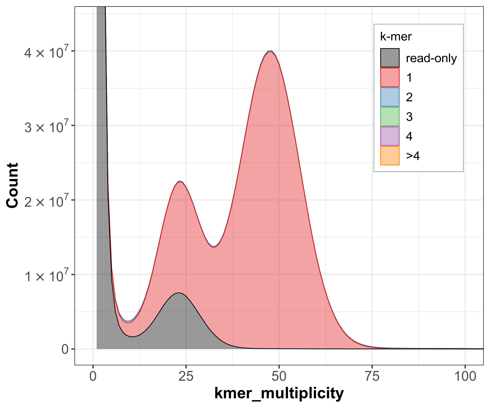
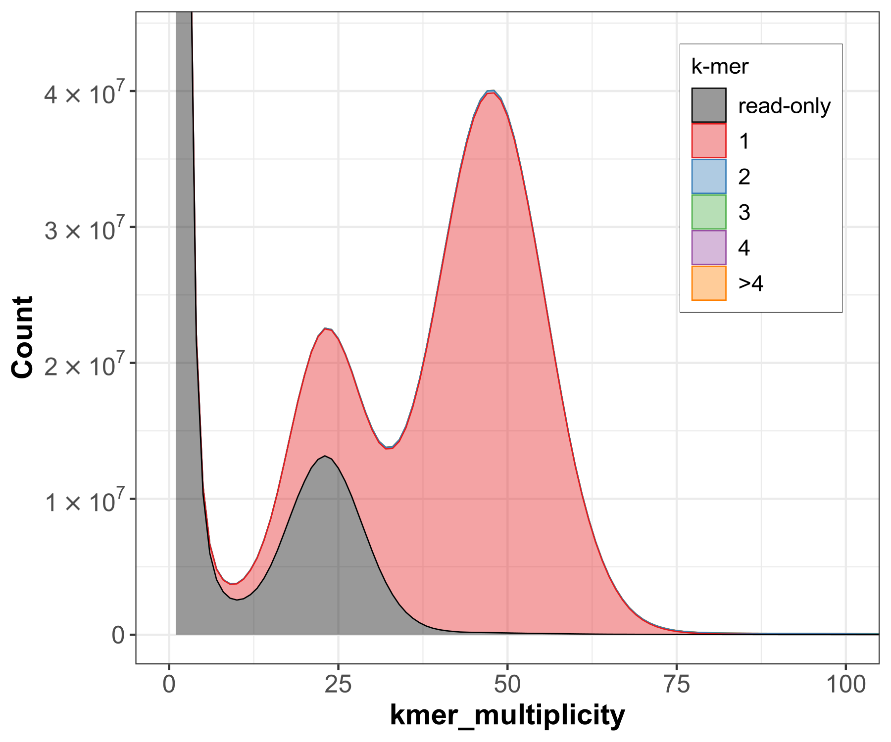

# Genome QC using kmer plots

When evaluating a genome assembly, some commonly QC metrics include QUAST and BUSCO. Another powerful tool is using kmer analysis, which can give info about genome completeness, reference-free accuracy estimates and levels of duplication. There are many tools for counting kmers, but for this pipeline we will use [Meryl](https://github.com/marbl/meryl) to build a kmer database in combination with [Merqury](https://github.com/marbl/merqury) to construct kmer frquency spectra and calculate quality stats. As mentioned, this does not require a separate reference genome...all you need is your de novo genome assembly and the reads used to construct the assembly.

As a note: `merqury` was originally designed to use Illumina sequencing reads, which are very high accuracy. It should still work current gen single molecule real-time sequencing reads such as PacBio Hifi (read accuracy ~99.9%) and more recent chemistries from Oxford Nanopore (read accuracy >98%), though the higher error rates compared to Illumina might affect some of the estimates.

## Installing the programs
While `merqury` can be installed using `conda/mamba` there are some environmental variables that still need to be set, and `meryl` need to be installed manually.


### Installing merqury

```
#Load python and create a conda environment
module load python

conda create -n merqury
conda activate merqury

conda install -c bioconda merqury

```

When you install `merqury`, it will print out a path that needs to be set as an environmental variable; you'll want to set this whenever you run the program. E.g.

```
MERQURY="/n/holylfs05/LABS/informatics/Users/dkhost/mamba/envs/merqury/share/merqury"
```

### Installing meryl
Meryl is available as an executable, so simply download it using `wget` in an appropriate spot (e.g. your directory in your lab storage) and unzip it. For convenience, we'll add the Meryl `/bin` directory to our `$PATH` environmental variable for easy reference: 

```
wget https://github.com/marbl/meryl/releases/download/v1.4.1/meryl-1.4.1.Linux-amd64.tar.xz
tar -xJf meryl-1.4.1.Linux-amd64.tar.xz

export PATH=/n/holylfs05/LABS/informatics/Users/dkhost/meryl-1.3/bin:$PATH
```


## Build the kmer database
First we need to construct a meryl database of the kmers in the reads to enable quick lookup. We can calculate the optimal kmer size using a script included as part of the `Merqury` package, `best_k.sh`. Set the genome size and, optionally, the error rate of the reads:

```
$MERQURY/best_k.sh [genome size] [tolerable_collision_rate=0.001]
```

### How does kmer size affect estimates?
Merqury looks at the proportions of kmers found in the reads vs the assembly to estimate assembly completeness and accuracy. If we set the kmer size too low we lose "resolution" and cannot detect genuine errors and run the risk of overestimating assembly quality value (QV) scores. 

Merqury was originally designed with an Illumina error rate in mind (i.e. Q30, or 0.001 error rate), and the `best_k.sh` script assumes this error rate. For sequencing with a higher error rate we can increase the `tolerable_collison_rate` parameter in the `best_k.sh` script, which will result in a smaller suggested kmer size. However, the developers recommend **k=31 as a good general setting, and k=21 as a minimum kmer size,**. Tl;dr: *generally it is a better idea to err on the side of caution and use a larger kmer size.* 

## Run Merqury
Building the kmer database is the most time consuming step, but depending on the size of your data it should finish in a couple of hours. Here is an example SLURM script to run the whole pipeline on the Cannon cluster. In this example we created our assembly using `hifiasm`, which produced a *primary assembly* (`aphWoo.p_ctg.fa`) and two *haplotype assemblies*, only one of which we are testing here (`aphWoo.hap1.p_ctg.fa`): 

```
#!/bin/bash
#SBATCH -J merqury # A single job name for the array
#SBATCH --partition=shared # Partition
#SBATCH -n 2 # Number of Nodes required
#SBATCH --mem=64G # Memory request
#SBATCH -t 1-0:00 # Maximum execution time (D-HH:MM)
#SBATCH -o merqury.out # Standard output
#SBATCH -e merqury.err # Standard error

#Activate environment
module load python
conda activate merqury

#Set paths to executables
MERQURY="/n/holylfs05/LABS/informatics/Users/dkhost/mamba/envs/merqury/share/merqury"
export PATH=/n/holylfs05/LABS/informatics/Users/dkhost/meryl-1.3/bin:$PATH

READS="/n/holylfs05/LABS/informatics/Lab/projects/tsackton/scrubjay/raw-data/MCZ_Orn_365336/*/*.fastq.gz"

#Build kmer database
meryl count k=31 output aphwoo_hifireads.meryl $READS

#Run Merqury
$MERQURY/merqury.sh aphwoo_hifireads.meryl aphWoo.p_ctg.fa aphWoo.hap1.p_ctg.fa merqury_aphwoo
```

## Output 
### Interpretting kmer copy number spectra
The kmer copy number spectrum plot (i.e. spectra-cn plot) compares the number of times a given kmer appears in the raw reads vs the number of times it appears in an assembly, which can give us information about assembly accuracy and completeness. It can also indicate whether there is sequence duplication in the assembly, e.g. if haplotigs are erroneously present (requiring removal with a pipeline like purge_haplotigs). All the actual stats values are present in other output from Merqury, but the spectra-cn plots are still useful for "eyeballing" our assembly to spot any potential problems. There's a lot of information in these plots, so let's walk thru some.

First, we can use the `*cn.hist` output file with the `plot_spectra_cn.R` script that is included with the Merqury repo to actually construct the spectrum histogram; the script will plot the data several different ways (line plot, filled histogram, stacked histogram), personally I find the "stacked" plot easiest to interpret. We'll construct a plot for both our primary assembly and our haplotype assembly:

```
Rscript $MERQURY/plot/plot_spectra_cn.R -f merqury_aphwoo.AW_365336.p_ctg.spectra-cn.hist -p -o merqury_aphwoo.AW_365336.p_ctg -m 100

Rscript $MERQURY/plot/plot_spectra_cn.R -f merqury_aphwoo.AW_365336.hap1.p_ctg.spectra-cn.hist -p -o merqury_aphwoo.AW_365336.hap1 -m 100
```

The `-p` argument outputs the plots as PDF files, and the `-m 100` argument sets the maximum of the x-axis to 100. 

'Kmer multiplicity' refers to home many times a given kmer occurs *in the read set*, while the line color refers to how many times a given kmer appears *in the assembly*. For a diploid organism like in our example, we should expect to see three main peaks. The peak around ~1 represents low frequency kmers that only occur a single time, and thus can be assumed to be sequencing errors. We then have two peaks: one centered around ~48, which corresponds to our sequencing depth and *represents kmers present in both haplotypes*, aka the 2-copy or homozygous peak. We should then have a smaller peak centered at roughly half coverage which *represents kmers present only in a single haplotype*, aka the 1-copy or heterozygous peak.



Let's focus now on the line color. Any kmers that are found only in the reads (colored black by default) represent sequence that is missing from the assembly. We can see that we have a small read-only peak centered at the same place as the 1-copy heterozygous peak...so, what does this mean? Recall that we are looking at a primary assembly produced by hifiasm, which can be thought of as the best attempt at "complete" representation of a haploid genome, with long stretches of phased blocks. However, for a given heterozygous site a primary assembly will only represent a single haplotype, thus the "read-only" peak at ~24x represents alternate haplotype kmers that were excluded from the primary assembly.

This is more clear when we look at the copy number spectrum for a haplotype assembly:



We can see a larger peak of read-only kmers centered at the 1-copy peak, indicating that this assembly is "less complete" and it missing more sequence than the primary assembly. This matches what we expect, as this assembly represents a *single* haplotype, and those missing kmers correspond to heterozygous sites that are in other haplotype assembly.


Another useful thing copy number spectra can tell us about an assembly is any *artificial duplications* that are present. One error that can arise during assembly is if a region is particularly heterozygous or contains paralogous duplications, those regions can be erroneously assembled as *separate* contigs in the primary assembly, resulting in false duplicate contigs in the assembly. In other words, sequence that we'd expect to only occur ONCE in the assembly is present multiple times, which would produce a kmer copy number spectrum that looks something like this:


While the shape of the spectrum is similar to the previous examples, we can see that both the 1-copy and 2-copy peaks have numerous kmers that occur twice in the assembly, indicating a high level of duplication. We would want to run tools such as `Purge Haplotigs` or `purge_dups` to flag and remove erroneous duplicate contigs.

### Assembly consensus quality value (QV)
Any kmers that are present in the assembly but NOT in the original sequencing reads can be assumed to be assembly errors. The `.qv` output file reports the number of kmers unique to the assembly (column 2) vs the total number of kmers in the assembly (column 3), which are used to calculate the QV score and error rate (columns 4 and 5).

```
AW_365336.p_ctg	32293	1318785980	61.0242	7.8991e-07
AW_365336.hap1.p_ctg	20140	1203516343	62.6775	5.3982e-07
Both	52433	2522302323	61.7355	6.70579e-07
```

### Assembly completeness
Conversely, kmers that are present in the reads but NOT in the assembly represent sequence that is missing from the assembly. Merqury only uses "solid" kmers for this estimate, i.e. kmers that have been filtered out low copy number kmers (which likely represent errors). 

`completeness = solid assembly kmers / solid read kmers`

The `*.completeness.stats` output file reports solid assembly kmers and solid read kmers in the 2nd and 3rd column and the completeness in the 4th. Note that if we are looking at an alternate or haplotype assembly, we would expect that assembly to have a lower completeness score as it is missing the other haplotype.

```
AW_365336.p_ctg	all	1046354638	1159144096	90.2696
AW_365336.hap1.p_ctg	all	963492058	1159144096	83.121
both	all	1099009727	1159144096	94.8122
```