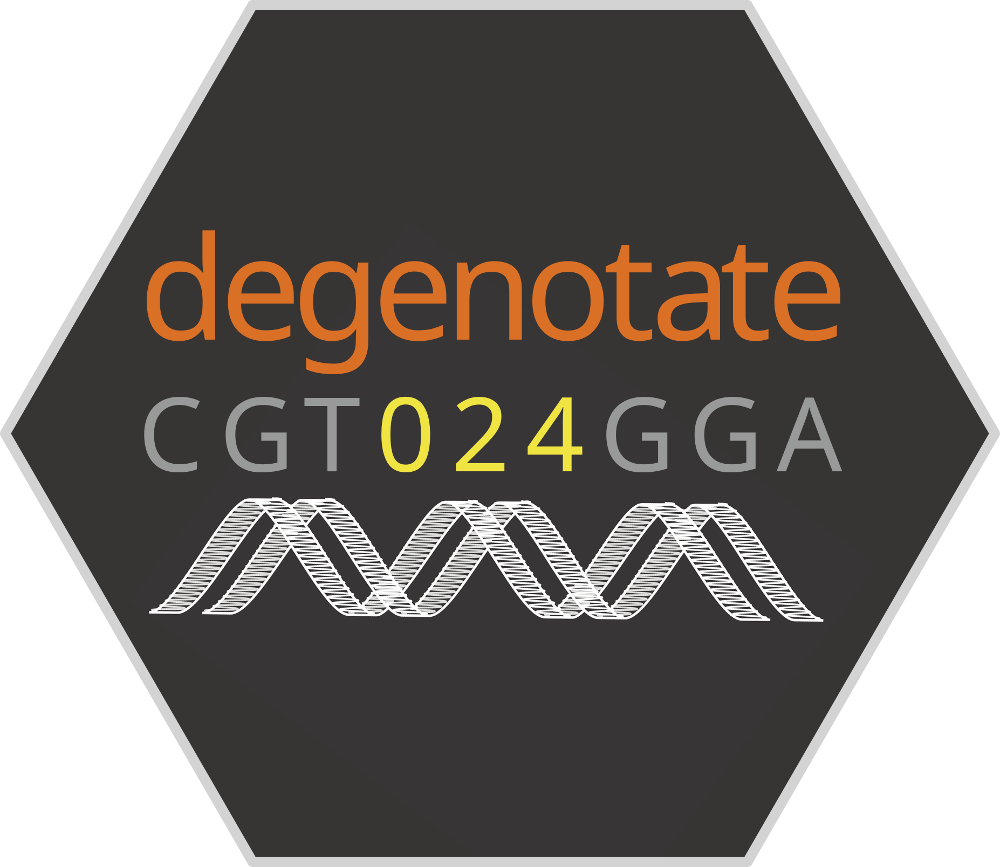

---
hide:
    - navigation
    - toc
---

# Software

The informatics group develops methods and software for various genomics tasks with an emphasis on reproducibility and ease of use. We aim to provide tools that fill gaps in the current genomics software ecosystem. We also collaborate both within and outside of Harvard to develop new methods.

## 

    

        

            
        

    

    

        <a href="https://phyloacc.github.io/" target="_blank">PhyloAcc <svg xmlns="http://www.w3.org/2000/svg" fill="currentColor" viewBox="0 0 24 24" width="24" height=1em><path d="M15.5 2.25a.75.75 0 0 1 .75-.75h5.5a.75.75 0 0 1 .75.75v5.5a.75.75 0 0 1-1.5 0V4.06l-6.22 6.22a.75.75 0 1 1-1.06-1.06L19.94 3h-3.69a.75.75 0 0 1-.75-.75Z"></path><path d="M2.5 4.25c0-.966.784-1.75 1.75-1.75h8.5a.75.75 0 0 1 0 1.5h-8.5a.25.25 0 0 0-.25.25v15.5c0 .138.112.25.25.25h15.5a.25.25 0 0 0 .25-.25v-8.5a.75.75 0 0 1 1.5 0v8.5a1.75 1.75 0 0 1-1.75 1.75H4.25a1.75 1.75 0 0 1-1.75-1.75V4.25Z"></path></svg></a> 
        
        is a program to detect shifts of DNA substitution rates in noncoding, conserved genomic regions. It can be used to identify genomic elements that have experienced accelerated rates along certain lineages in a phylogeny. This can be used, for example, to identify convergent rate shifts that coincide with phenotypic convergence. 

        We have developed this in conjunction with the 
        
        <a href="https://edwards.oeb.harvard.edu/" target="_blank">Edwards Lab <svg xmlns="http://www.w3.org/2000/svg" fill="currentColor" viewBox="0 0 24 24" width="24" height=1em><path d="M15.5 2.25a.75.75 0 0 1 .75-.75h5.5a.75.75 0 0 1 .75.75v5.5a.75.75 0 0 1-1.5 0V4.06l-6.22 6.22a.75.75 0 1 1-1.06-1.06L19.94 3h-3.69a.75.75 0 0 1-.75-.75Z"></path><path d="M2.5 4.25c0-.966.784-1.75 1.75-1.75h8.5a.75.75 0 0 1 0 1.5h-8.5a.25.25 0 0 0-.25.25v15.5c0 .138.112.25.25.25h15.5a.25.25 0 0 0 .25-.25v-8.5a.75.75 0 0 1 1.5 0v8.5a1.75 1.75 0 0 1-1.75 1.75H4.25a1.75 1.75 0 0 1-1.75-1.75V4.25Z"></path></svg></a> 
        
        in the Organismic and Evolutionary Biology department and the Museum of Comparative Zoology and the 
        
        <a href="https://sites.harvard.edu/junliu/" target="_blank">Liu Lab <svg xmlns="http://www.w3.org/2000/svg" fill="currentColor" viewBox="0 0 24 24" width="24" height=1em><path d="M15.5 2.25a.75.75 0 0 1 .75-.75h5.5a.75.75 0 0 1 .75.75v5.5a.75.75 0 0 1-1.5 0V4.06l-6.22 6.22a.75.75 0 1 1-1.06-1.06L19.94 3h-3.69a.75.75 0 0 1-.75-.75Z"></path><path d="M2.5 4.25c0-.966.784-1.75 1.75-1.75h8.5a.75.75 0 0 1 0 1.5h-8.5a.25.25 0 0 0-.25.25v15.5c0 .138.112.25.25.25h15.5a.25.25 0 0 0 .25-.25v-8.5a.75.75 0 0 1 1.5 0v8.5a1.75 1.75 0 0 1-1.75 1.75H4.25a1.75 1.75 0 0 1-1.75-1.75V4.25Z"></path></svg></a> 
        
        in the Department of Statistics.
    

---

##

    

        
    

    

        <a href="https://github.com/harvardinformatics/snpArcher" target="_blank">snpArcher</a> is a reproducible workflow optimized for nonmodel organisms and comparisons across datasets, built on the <a href="https://snakemake.readthedocs.io/en/stable/index.html#" target="_blank">Snakemake</a> workflow management system. It provides a streamlined approach to dataset acquisition, variant calling, quality control, and downstream analysis.
    

---

##

    

        
    

    

        <a href="https://github.com/harvardinformatics/degenotate" target="_blank">degenotate</a> takes as input either a genome FASTA file and a corresponding annotation file (GFF or GTF) OR file or directory of files that contain coding sequences in FASTA format and outputs a bed-like file that contains the degeneracy score (0-, 2-, 3-, or 4-fold) of every coding site.

        If given a corresponding VCF file with specified outgroup samples, degenotate can also count synonymous and non-synonymous polymorphisms and fixed differences for use in MK tests (McDonald and Kreitman 1991).

        The program also offers coding sequence extraction from the input genome and extraction of sequences by degeneracy (e.g. extract only the 4-fold degenerate sites).
    

---

##

    

        
    

    

        <a href="https://github.com/harvardinformatics/scclusteval" target="_blank">scclusteval</a> (Single Cell Cluster Evaluation) evaluates the single cell clustering stability by subsampling the cells and provide many visualization methods for comparing clusters.
    

---

##

    

        
    

    

        <a href="https://github.com/harvardinformatics/HieRFIT" target="_blank">HieRFIT</a> is a hierarchical cell type classification tool for projections from complex single-cell atlas datasets. HieRFIT stands for Hierarchical Random Forest for Information Transfer.
    

---

##

    

        

            <a href="https://github.com/harvardinformatics/Genrich" target="_blank">Genrich</a>
        

    

    

        <a href="https://github.com/harvardinformatics/Genrich" target="_blank">Genrich</a> is a peak-caller for genomic enrichment assays (e.g. ChIP-seq, ATAC-seq). It analyzes alignment files generated following the assay and produces a file detailing peaks of significant enrichment.
    

---

##

    

        

            <a href="https://github.com/harvardinformatics/NGmerge" target="_blank">NGmerge</a>
        

    

    

        <a href="https://github.com/harvardinformatics/NGmerge" target="_blank">NGmerge</a> merges paired-end reads and removing sequencing adapters. In the default stitch mode, NGmerge combines paired-end reads that overlap into a single read that spans the full length of the original DNA fragment. The alternative adapter-removal mode returns the original reads as pairs, removing the 3' overhangs of those reads whose valid stitched alignment has this characteristic.
    

---

